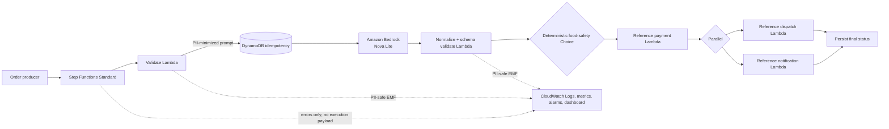

# Intelligent Delivery Orchestrator

Production-oriented serverless workflow combining deterministic orchestration with Generative AI
for intelligent delivery order processing.

> **Independent engineering case by Yan Costa Carneosso.** This repository is an implementation of
> a proposed architecture challenge; it is not an AWS sample and is not affiliated with AWS.

## Why this project exists

Delivery orders mix deterministic obligations—valid payment, idempotency, failure policy—with
unstructured signals such as sentiment, dietary restrictions, and allergy language. This project
keeps those concerns on opposite sides of a strict contract:

```text
LLM = probabilistic reasoning       Workflow = deterministic control
Schema = contract                  IAM = trust boundary
Tests = evidence                   Observability = accountability
```

Amazon Nova Lite extracts structured signals. It **cannot approve payment or clear a food-safety
risk**. AWS Step Functions Standard validates, persists the idempotency claim, applies auditable
rules, invokes reference effect adapters, and records the outcome.

## Architecture



The Bedrock call uses the optimized direct integration
`arn:aws:states:::bedrock:invokeModel`; no proxy Lambda hides the cognitive boundary. See
[architecture](docs/architecture.md) and the [ADRs](docs/adr/).

## What is implemented

- AWS SAM stack: Standard Workflow, five focused Lambdas, DynamoDB, IAM, log retention, dashboard,
  and alarms.
- Current Nova Lite Messages API contract (`amazon.nova-lite-v1:0`) with a versioned system prompt.
- Draft 2020-12 JSON Schemas with closed objects, limits, enums, and negative tests.
- Deterministic allergy detector that wins over contradictory model output and prompt injection.
- Conditional idempotency claim before Bedrock or side effects.
- Selective retry: transient infrastructure errors only; invalid input/model output is not retried.
- Local executable simulator with explicitly non-AWS, non-LLM reference adapters.
- Unit, contract, negative, safety, workflow, and opt-in deployed-AWS tests.
- CI quality gates for format, lint, types, schemas, workflow structure, tests, dependencies, secrets,
  and SAM/CloudFormation validation.

## Five-minute quick start

Linux/macOS:

```bash
make setup
make test
make demo
```

Windows PowerShell (works without `make`):

```powershell
.\scripts\dev.ps1 setup
.\scripts\dev.ps1 test
.\scripts\dev.ps1 demo
```

The demo executes validation, safety analysis, deterministic local cognitive analysis, payment,
dispatch, and notification adapters. Its output is labeled `LOCAL_DETERMINISTIC_MOCK`; it never
pretends to have called AWS or a real provider.

```text
LOCAL DEMO — no AWS or LLM calls were made

Order: ORD-ALG-001
Schema validation............. PASS
Idempotency claim............. PASS
Cognitive analysis............ PASS
Payment....................... APPROVED
Dispatch...................... SUCCESS
Notification.................. SUCCESS
...
Workflow result: COMPLETED
```

## AWS deployment

Prerequisites: AWS CLI, AWS SAM CLI, Docker for SAM builds when required, credentials authorized to
deploy the resources, and Bedrock model access in `us-east-1`.

```bash
export AWS_REGION=us-east-1
make deploy
export STATE_MACHINE_ARN="$(aws cloudformation describe-stacks \
  --stack-name intelligent-delivery-orchestrator-dev \
  --query 'Stacks[0].Outputs[?OutputKey==`StateMachineArn`].OutputValue' \
  --output text)"
make integration-test
make destroy
```

Deployment is intentionally manual and may incur AWS charges. The stack's payment, dispatch, and
notification Lambdas are **reference adapters that perform no external side effect**. Replace them
before production; see [known limitations](#known-limitations).

## Quality and evidence

```bash
make ci             # all local quality gates
make benchmark      # local simulator only; explicitly not an AWS benchmark
make build          # SAM build
sam validate --lint # CloudFormation/SAM validation
```

The last verified results for this checkout belong in the engineering handoff, not as permanent
claims in this README. GitHub Actions publishes JUnit and coverage artifacts on every run.

### Metrics: claims versus goals

| Category | Statement |
|---|---|
| Technical target | End-to-end latency `<800 ms` (aspirational; may conflict with model latency/cold starts) |
| AWS measurement | **Not yet measured in a deployed environment** |
| Local measurement | Generated only by `make benchmark`; not representative of AWS/Bedrock |
| Business KPI | Fewer allergy incidents, support contacts, and payment/logistics mismatches |
| Projected benefit | Requires a controlled pilot and baseline; no benefit is claimed as measured |

## Security and operations

The system excludes address and payment method from Bedrock input, disables Step Functions execution
payload logging, retains logs for 30 days by default, encrypts DynamoDB, and scopes IAM to concrete
resources. The only `Resource: "*"` permission is isolated to CloudWatch Logs delivery control-plane
APIs that lack resource-level authorization. Start with the [threat model](docs/threat-model.md),
[privacy assessment](docs/privacy.md), and [operations runbook](docs/operations.md).

## Cost

The reproducible model uses documented token/transition assumptions and shows approximately **$5.27,
$52.66, and $526.63 per month** at 10k, 100k, and 1M successful orders respectively, before free
tiers, retries, taxes, and regional variation. These are estimates—not bills. Recalculate with:

```bash
python scripts/cost_estimate.py
```

See [cost model](docs/cost-model.md) for sources and sensitivity analysis.

## Repository map

```text
amazon-bedrock/        versioned prompt and Nova request configuration
aws-step-functions/    deployed Amazon States Language definition
schemas/               closed input and model-output contracts
src/                   domain, safety controls, adapters, Lambdas, local simulator
tests/                 unit, contract, workflow, safety, fixtures, AWS integration marker
scripts/               validation, benchmark, cost and integration harnesses
docs/                  architecture, ADRs, security, privacy, cost and reviewer guides
template.yaml          deployable AWS SAM infrastructure
.github/               CI and repository governance
```

## Known limitations

- There is no public HTTP ingress or authentication layer; executions start via authorized Step
  Functions API calls.
- Reference adapters do not charge, dispatch, or notify. Real providers require secrets management,
  provider idempotency keys, PCI/security review, and contract tests.
- Nova Lite behavior and the `<800 ms` target require deployed evaluation; local tests prove control
  policy, not model quality or production latency.
- Food vocabulary matching intentionally favors false positives over false negatives; a production
  food-safety program still needs kitchen controls and human escalation.
- No AWS deployment was performed merely by cloning or testing this repository.

## Continue the review

Start with the [five-minute recruiter guide](docs/recruiter-guide.md), then inspect the
[state machine](aws-step-functions/workflow.asl.json), [safety tests](tests/unit/test_safety.py),
[prompt-injection workflow test](tests/workflow/test_local_workflow.py), and
[architecture decisions](docs/adr/).

## License and author

MIT licensed. Designed and implemented by **Yan Costa Carneosso**.

