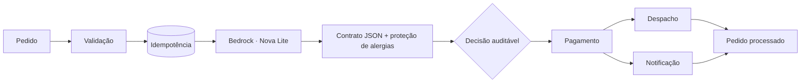

<div align="center">
  

  # Intelligent Delivery Orchestrator

  **Orquestração serverless de pedidos de delivery com IA generativa, decisões auditáveis e segurança alimentar.**

  [](https://github.com/YanCarneosso/intelligent-delivery-orchestrator/actions/workflows/ci.yml)
  
  
  
  [](LICENSE)
</div>

## Sobre o projeto

Este projeto demonstra como combinar **Amazon Bedrock e Amazon Nova Lite** com **AWS Step Functions** para interpretar pedidos em linguagem natural sem entregar decisões críticas ao modelo de IA.

O princípio central é simples:

```text
IA interpreta  •  Schema estabelece o contrato  •  Workflow decide
IAM delimita a confiança  •  Testes produzem evidências
```

O modelo identifica intenção, sentimento e restrições alimentares. Pagamento, idempotência, segurança, retries, despacho e auditoria permanecem determinísticos.

## Visão geral da arquitetura



A chamada ao Bedrock é feita diretamente pela integração otimizada do Step Functions. Uma camada determinística impede que uma resposta inválida ou uma tentativa de prompt injection remova um risco de alergia identificado.

## O que você encontrará aqui

- Infraestrutura reproduzível com AWS SAM.
- State machine Standard com `Choice`, `Parallel`, retries seletivos e tratamento de falhas.
- Contratos JSON Schema para entrada e saída do modelo.
- Defesa em profundidade para alergias e prompt injection.
- Idempotência com escrita condicional no DynamoDB.
- Observabilidade com CloudWatch, métricas, alarmes e dashboard.
- Testes unitários, de contrato, segurança e workflow, além de CI no GitHub Actions.
- Demo local que não exige conta AWS.

## Experimente localmente

### Windows PowerShell

```powershell
.\scripts\dev.ps1 setup
.\scripts\dev.ps1 test
.\scripts\dev.ps1 demo
```

### Linux e macOS

```bash
make setup
make test
make demo
```

O demo é identificado como `LOCAL_DETERMINISTIC_MOCK`: ele exercita o fluxo real do projeto, mas não chama AWS, LLM ou provedores externos.

## Documentação completa

| Tema | Documento |
|---|---|
| Arquitetura e fluxo de execução | [Arquitetura](docs/architecture.md) |
| Decisões e trade-offs | [Architecture Decision Records](docs/adr/) |
| Segurança e ameaças | [Threat model](docs/threat-model.md) |
| Privacidade e tratamento de dados | [Privacidade](docs/privacy.md) |
| Operação, incidentes e rollback | [Runbook operacional](docs/operations.md) |
| Custos e cenários de volume | [Modelo de custos](docs/cost-model.md) |
| Métricas técnicas e de negócio | [Métricas](docs/business-metrics.md) |
| Avaliação rápida do repositório | [Guia para recrutadores](docs/recruiter-guide.md) |
| Proteção da branch principal | [Branch protection](docs/branch-protection.md) |

> Para uma avaliação técnica em aproximadamente cinco minutos, comece pelo [guia para recrutadores](docs/recruiter-guide.md).

## Transparência

Os adaptadores de pagamento, despacho e notificação são referências sem efeitos externos. Resultados locais não são apresentados como medições de produção, e nenhum benefício de negócio é tratado como resultado comprovado sem uma integração real.

## Autor

Implementação independente desenvolvida por **Yan Costa Carneosso**.

Distribuído sob a [Licença MIT](LICENSE).
